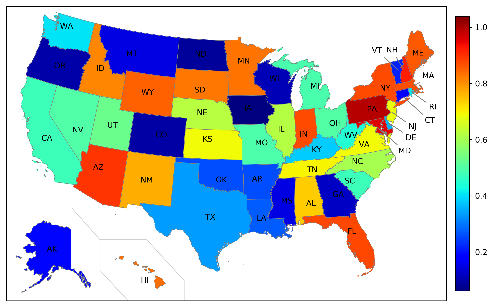

# Plotting data on US map

[Basemap](https://matplotlib.org/basemap/index.html#) is a matplotlib toolkit 
for plotting 2D data on maps in Python.

This repo is constructed for easier use of Basemap. A Statesmap class was built 
in Statesmap.py, where customized settings was specified to cover all states
in US (except DC and Puerto Rico). With this class object, one can simply input
data as a dictionary and the final figure looks like the figure below:

Note: src folder contains some necessary geometry files for each state and 
a csv file that has the full name of each state and its corresponding
abbreviation.
